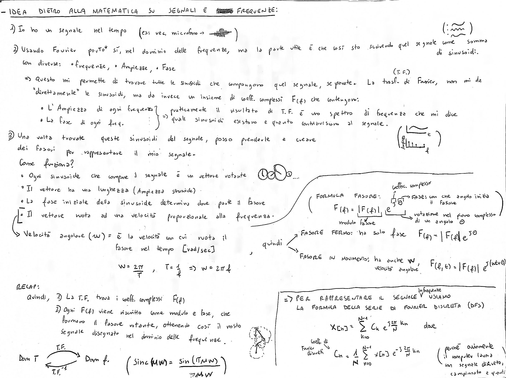
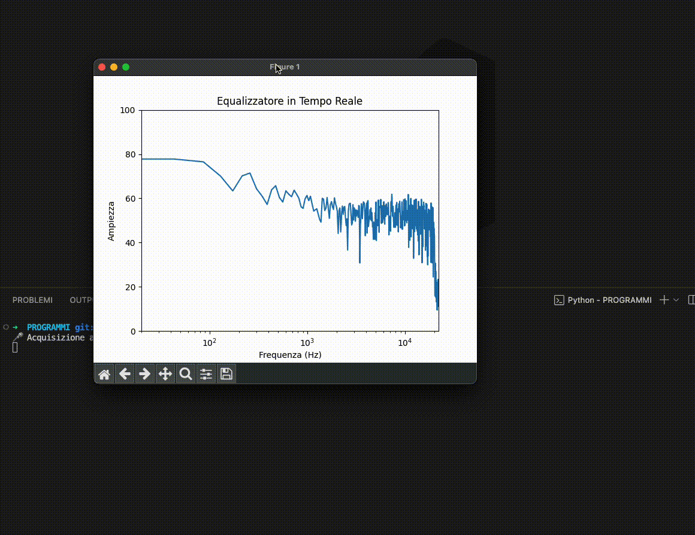
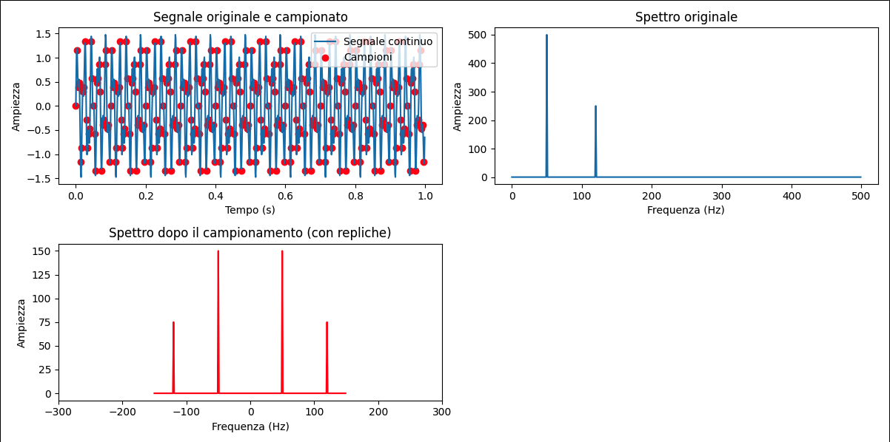
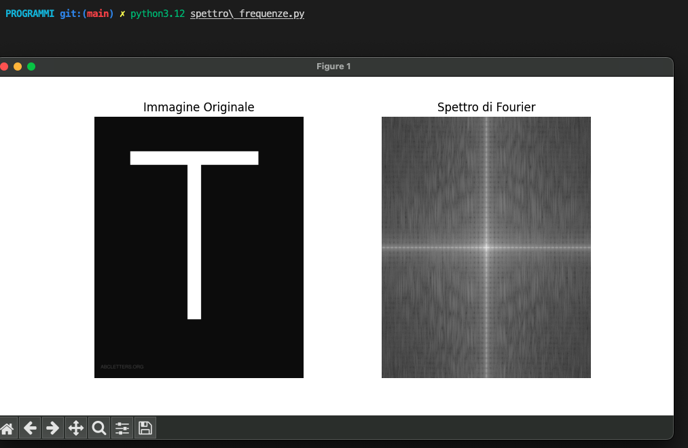
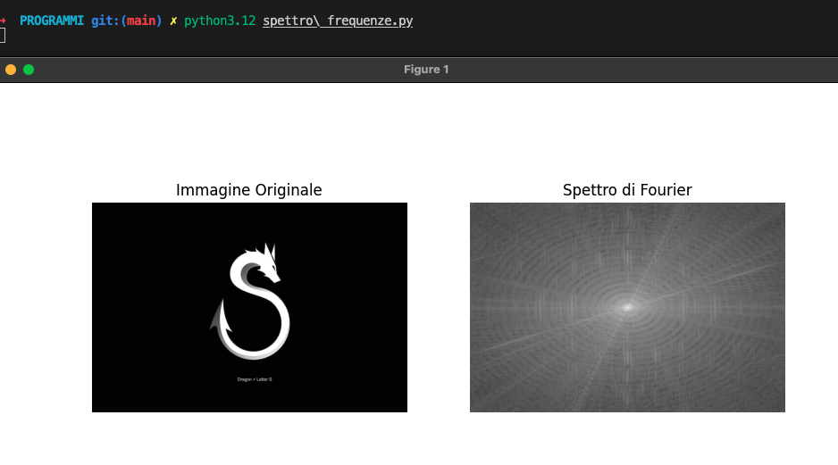
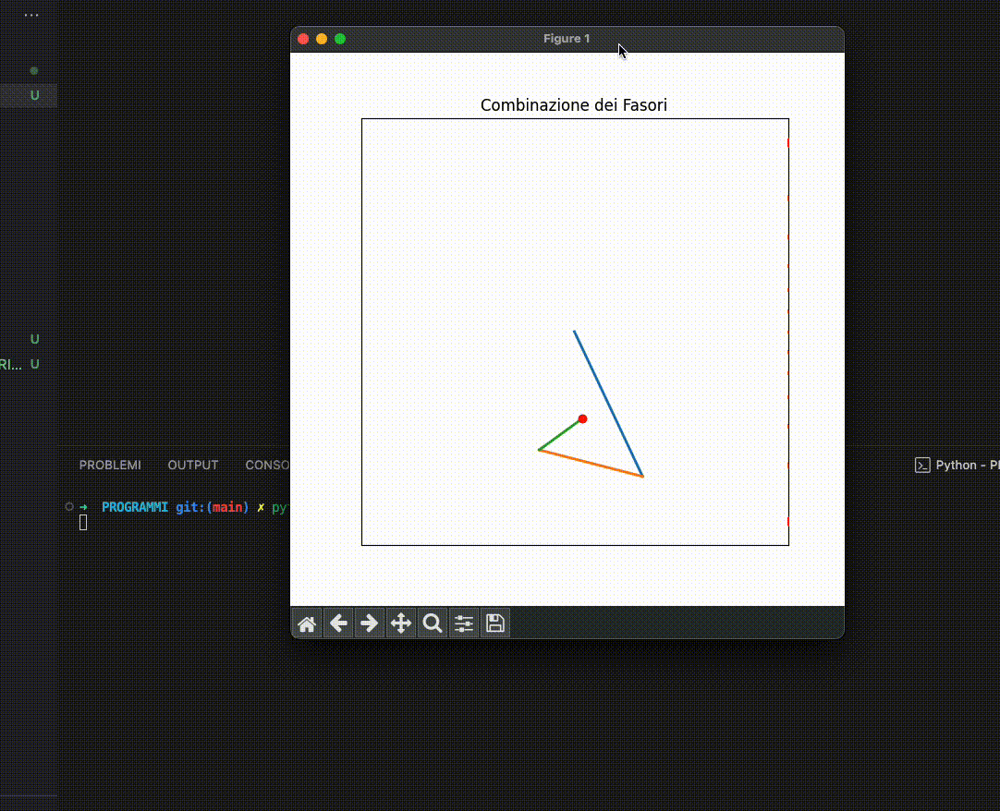

# 📡 Sistemi, Segnali ed Elaborazione Immagini
- - - - - - - - - - - - - - - - - - - - - - - - -

## 📖 Introduzione
> Una Repository che contiene appunti ed esperimenti sul mondo dei segnali, frequenze, immagini e filtri.
  Nato dallo studio per i corrispettivi esami e molta curiosità personale.

- - -
## 🛠️ Installazione
Per eseguire il progetto, è necessario installare le seguenti librerie Python:

    matplotlib==3.10.0
    numpy==2.2.2
    opencv_python==4.11.0.86
    PyAudio==0.2.14
    scipy==1.15.1

### Installazione automatica:
    pip install -r requirements.txt

### oppure manualmente: 
    pip install matplotlib==3.10.0 numpy==2.2.2 opencv_python==4.11.0.86 PyAudio==0.2.14 scipy==1.15.1

- - -

- - - - 

- - - -

- - - -

- - - -

- - - -

- - - -
